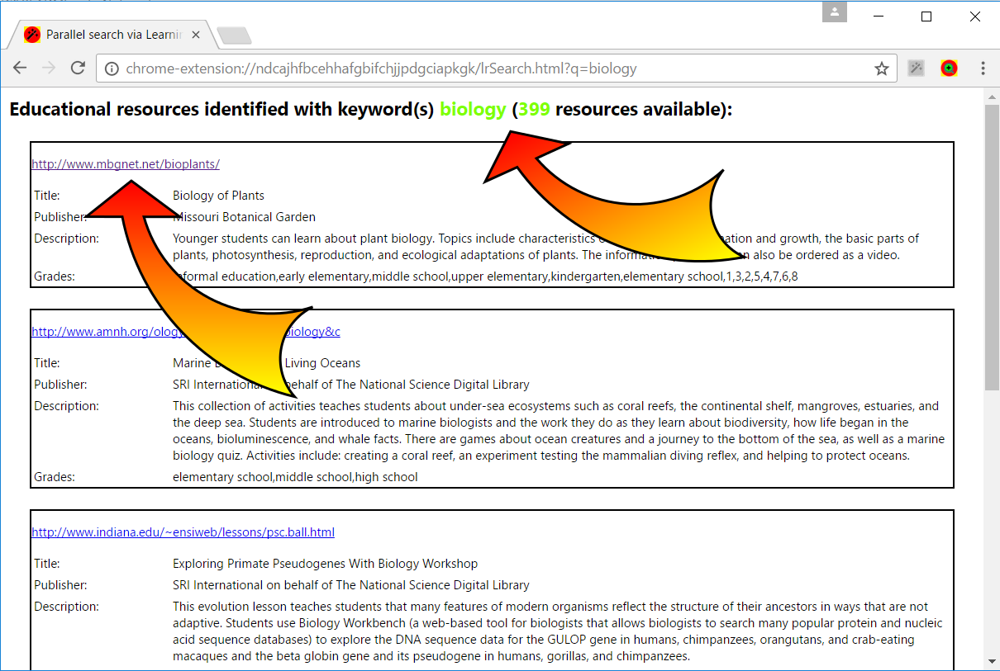

# **RepExp**: Replicator-Expander

RepExp is a prototype supporting the **discovery of educational resources**. It consists of a pair of Chrome™ browser extensions, **“Replicator”** and **“Expander”**. 

**Replicator** intercepts user Google™ searches and replicates them in the [Learning Registry](http://learningregistry.org), producing a custom SERP with plenty of resources and related (LRMI) educational metadata.

**Expander** allows the user examining an educational resource, to identify additional similar resources: “***similar***” according to a similarity metric defined as the number of shared alignments to educational standards.

The system makes transparent use of (sometimes large numbers of) standards alignments without the need for users to be aware of them. This makes it possible, among other advantages, to reuse the considerable efforts in aligning resources to educational standards, as crowdsourced high-quality curated data, in Countries where formal educational standards are not used.

### Where it comes from
RepExp represents the evolution of an early prototype: the [Educational Resources Discoverer - ERD](https://github.com/renatomario/ERD). That early prototype identified educational resources within Google™ SERPs, where it injected custom-rich-snippets containing “transparent” expansion functionalities to (or suggestions for) “similar” resources, in addition to LRMI metadata. While that was considered very useful as a proof of concept, it suffered from the limited number of educational resources that could be identified within Google™ SERPs (intrinsic metadata sparsity). **RegExp is a new prototype that solves that problem**.

### Commented screenshots

A discovery exploratory activity is initiated by clicking on the Replicator extension button (top right), automatically activated in any standard Google™ SERP page:

The system intercepts the user Google™ search keywords and replicates the search in the Learning Registry, producing a custom SERP with plenty of resources and related (LRMI) educational metadata. In this case, 399 educational resources have been identified:

The user explores the resources; at any time he can click on the Expander extension button (top right):

The system displays a ranked list of educational resources similar to the currently visited resource, 1345 in this case, with relevant (LRMI) educational metadata:

From here, the user can navigate to any of these resources, explore them, and further ask again for additional resources similar to the current resource he is exploring . At any time, the user can consult the navigation path of his exploratory activities:

### Feedback
Main objective of this prototype is to share ideas being developed in a research project, investigating solutions to support the discoverability of (open) educational resources: any feedback is definitely welcome!

### Acknowledgments
The development of RepExp has been possible thanks to the *multi-faceted openness* of the Learning Registry: 
- openness of **educational content** (as in “OER” - Open Educational Resources), 
- openness of **metadata**,
- openness of REST **services**.

